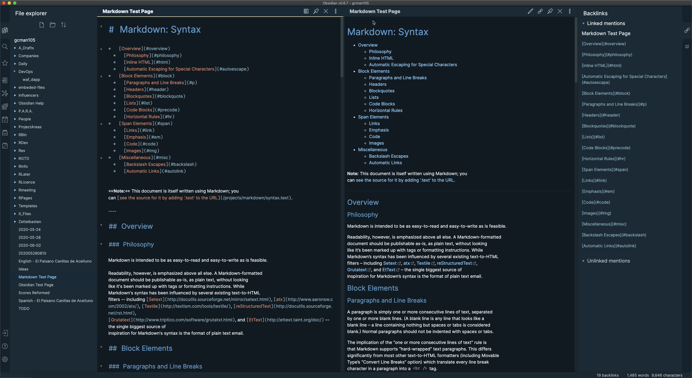

# Obsidian canillas theme

An adaptation of the [nord](https://github.com/arcticicestudio/nord) theme for
[Obsidian](https://obsidian.md). It only supports a dark mode.

Simply copy the `obsidian.css` file to your vault directory and reload
Obsidian for it to take effect.

